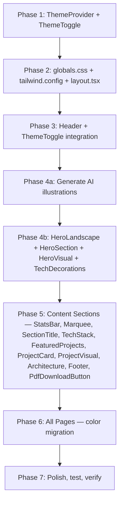

# Redesign Portfolio: Warm Flat-Illustration Style with Day/Night Toggle

Transform the current industrial/HUD dark theme (ember red, grid-lines, grain overlay) into a warm, friendly, flat-illustration aesthetic with smooth day/night mode transition.

## Current State Summary

| Aspect | Current |
|--------|---------|
| **Aesthetic** | Industrial HUD — dark void `#0A0A0A`, red accent `#DC2626`, grid-lines, grain overlay, dashed orbits |
| **Fonts** | Display: `Bebas Neue` (condensed caps), Body: `Inter` |
| **Framework** | Next.js 14.2, Tailwind CSS 3.4, Framer Motion 12, Lucide React |
| **Pages** | Home, About, Projects, Project Detail `[slug]`, Resume, Contact, Portfolio-PDF |
| **Components** | Header, HeroSection, HeroVisual, StatsBar, Marquee, TechStackShowcase, FeaturedProjects, ProjectCard, ProjectVisual, ArchitectureShowcase, TechDecorations, SectionTitle, Footer, PdfDownloadButton |
| **Dark mode** | None — permanently dark |

---

## Resolved Decisions

| Decision | Resolution |
|----------|-----------|
| **Display Font** | ✅ `Bebas Neue` → **`Outfit`** (rounded geometric sans-serif, warm & friendly) |
| **Illustration Approach** | ✅ **Hybrid** — inline SVG for small animated decorations (floating icons, particles) + AI-generated images for hero landscape background layers |
| **Parallax Depth** | ✅ **3 layers** (sky → hills with dev objects → foreground grass/elements) |
| **Theme Persistence** | ✅ Save to `localStorage`, detect system preference on first visit |

---

## Proposed Changes

### Design System — Color Palette

#### Light Mode (Day)
| Token | Hex | Usage |
|-------|-----|-------|
| `--bg-primary` | `#F0F7FF` | Page background (soft sky-white) |
| `--bg-secondary` | `#FFFFFF` | Cards, sections |
| `--bg-elevated` | `#E8F4FD` | Elevated panels |
| `--text-primary` | `#1A2B3C` | Headings (deep navy) |
| `--text-secondary` | `#5A6B7C` | Body text |
| `--text-muted` | `#8A9BAC` | Captions, labels |
| `--accent` | `#2D9B6E` | Accent highlight (green) |
| `--accent-soft` | `#E6F5EE` | Accent backgrounds |
| `--sky-top` | `#87CEEB` | Sky gradient top |
| `--sky-bottom` | `#C5E8D5` | Sky gradient bottom (grass meet) |
| `--border` | `#D1E3F0` | Border color |
| `--cta-bg` | `#2D9B6E` | Primary CTA |
| `--cta-hover` | `#238B5E` | CTA hover |
| `--warm-accent` | `#F4A843` | Orange/yellow accent (flowers, warmth) |

#### Dark Mode (Night)
| Token | Hex | Usage |
|-------|-----|-------|
| `--bg-primary` | `#0B1426` | Deep navy night sky |
| `--bg-secondary` | `#111D33` | Cards, sections |
| `--bg-elevated` | `#162340` | Elevated panels |
| `--text-primary` | `#E8F0F8` | Headings (bright white-blue) |
| `--text-secondary` | `#9AAFCC` | Body text |
| `--text-muted` | `#5A7099` | Captions, labels |
| `--accent` | `#5BEAD6` | Mint/teal highlight |
| `--accent-soft` | `#0D2A2D` | Accent backgrounds |
| `--sky-top` | `#070E1A` | Night sky top |
| `--sky-bottom` | `#0A2020` | Night sky bottom (dark teal) |
| `--border` | `#1E3050` | Border color |
| `--cta-bg` | `#5BEAD6` | Primary CTA (teal) |
| `--cta-hover` | `#4BD4C0` | CTA hover |
| `--warm-accent` | `#F4D06F` | Warm yellow accent (stars, moon glow) |

---

### Component & File Change Map

---

#### Phase 1: Theme Infrastructure (New)

##### [NEW] [ThemeProvider.tsx](file:///c:/laragon/www/RidBar%20Portofolio/components/ThemeProvider.tsx)
- React Context provider for day/night theme state
- Toggles `data-theme="light"` / `data-theme="dark"` attribute on `<html>`
- **Persists choice to `localStorage`** under key `"ridbar-theme"`
- On first visit: detects `prefers-color-scheme`, fallback to `"light"`
- Provides `useTheme()` hook → `{ theme: 'light' | 'dark', toggleTheme: () => void }`
- Wraps children with `<ThemeContext.Provider>`

##### [NEW] [ThemeToggle.tsx](file:///c:/laragon/www/RidBar%20Portofolio/components/ThemeToggle.tsx)
- Sun ☀️ / Moon 🌙 toggle button for navbar
- Smooth morphing animation between sun ↔ moon icons using Framer Motion SVG path animation
- `aria-label` for accessibility ("Switch to dark mode" / "Switch to light mode")
- Compact pill-shaped button that fits naturally in the navbar

---

#### Phase 2: Global Styles & Config

##### [MODIFY] [globals.css](file:///c:/laragon/www/RidBar%20Portofolio/app/globals.css)
**What changes:**
- Add `[data-theme="light"]` block with all light mode CSS custom properties
- Add `[data-theme="dark"]` block with all dark mode CSS custom properties
- Add `body` transition: `transition: background-color 0.6s ease, color 0.4s ease` for smooth theme swap
- **Remove**: `grain-overlay` pseudo-element, `grid-lines` background pattern, red radial gradient on body
- **Remove**: `::selection` red color → replace with `background: var(--accent)`
- **Update** scrollbar colors to use `var(--bg-primary)` / `var(--border)` / `var(--accent)`
- **Add** new keyframes:
  - `cloud-drift`: horizontal float for cloud elements (0% → 100% translateX with wrap)
  - `star-twinkle`: opacity pulse for star particles
  - `bob`: gentle vertical float for decorative dev icons
  - `parallax-shift`: subtle Y-axis shift tied to scroll
- **Keep**: `marquee-track` animation, `reveal-up` animation (still useful)
- **Remove**: `anim-reveal-*` delay classes (will use Framer Motion stagger instead — already in use)

##### [MODIFY] [tailwind.config.ts](file:///c:/laragon/www/RidBar%20Portofolio/tailwind.config.ts)
**What changes:**
- **Replace entire color palette**. Old tokens (void, surface, elevated, ember, bone, fog, chalk, etc.) → new semantic tokens referencing CSS variables:
  ```ts
  colors: {
    'bg-primary': 'var(--bg-primary)',
    'bg-secondary': 'var(--bg-secondary)',
    'bg-elevated': 'var(--bg-elevated)',
    'text-primary': 'var(--text-primary)',
    'text-secondary': 'var(--text-secondary)',
    'text-muted': 'var(--text-muted)',
    accent: { DEFAULT: 'var(--accent)', soft: 'var(--accent-soft)' },
    border: 'var(--border)',
    cta: { DEFAULT: 'var(--cta-bg)', hover: 'var(--cta-hover)' },
    warm: 'var(--warm-accent)',
    // Keep some legacy tokens mapped to new ones for transition
    ink: 'var(--text-primary)',
    cloud: 'var(--bg-primary)',
    signal: 'var(--accent)',
    steel: 'var(--text-secondary)',
    line: 'var(--border)',
  }
  ```
- **Font family**: `display` → `['var(--font-display)', 'Outfit', 'sans-serif']`
- **Add keyframes**: `cloud-drift`, `star-twinkle`, `bob`
- **Remove**: `pulse-glow` with red box-shadow
- **Update** `boxShadow.glow` from red → `rgba(45, 155, 110, 0.2)` (green glow)

##### [MODIFY] [layout.tsx](file:///c:/laragon/www/RidBar%20Portofolio/app/layout.tsx)
**What changes:**
- Replace `Bebas_Neue` import → `Outfit` from `next/font/google` with `weight: ['400','500','600','700','800','900']`
- Rename CSS variable from `--font-display` to still use `--font-display` (same var name, different font)
- Wrap `{children}` with `<ThemeProvider>` component
- Update `<html>` to include `data-theme="light"` as server-side default (ThemeProvider hydrates correct value on client)
- Update body className: `bg-void font-body text-chalk` → `bg-bg-primary font-body text-text-primary`

---

#### Phase 3: Header & Navigation

##### [MODIFY] [Header.tsx](file:///c:/laragon/www/RidBar%20Portofolio/components/Header.tsx)
**What changes:**
- **Color migration**: Replace all hardcoded dark colors:
  - `bg-void/82` → `bg-bg-primary/82`
  - `text-bone` → `text-text-primary`
  - `text-fog` → `text-text-secondary`
  - `border-white/10` → `border-border`
  - `bg-ember` / `hover:bg-ember-dark` → `bg-cta` / `hover:bg-cta-hover`
- **Add `<ThemeToggle />`** in desktop nav: placed between the last nav link and the "Hire Me" button
- **Add `<ThemeToggle />`** in mobile slide-out drawer: placed above "Hire Me" button
- **Logo styling**: "RIDHA" in `text-text-primary`, "AKBAR" in `text-accent` (accent color for brand identity)
- **Soften mobile drawer**: Change from sharp edges to `rounded-2xl` left border, softer backdrop
- **Soften "Hire Me" button**: Add `rounded-lg` instead of sharp rectangle

---

#### Phase 4: Hero Section (Major Visual Redesign)

##### [NEW] [HeroLandscape.tsx](file:///c:/laragon/www/RidBar%20Portofolio/components/HeroLandscape.tsx)
**Purpose**: Full illustrated landscape background for the hero section with 3-layer parallax

**Architecture:**
```
┌──────────────────────────────────────────────┐
│ Layer 1 (BACK) — Sky                         │
│ • Light: blue gradient + AI-generated clouds │
│ • Dark: navy gradient + twinkling star SVGs  │
│ • Parallax: moves slowest (0.15x scroll)     │
├──────────────────────────────────────────────┤
│ Layer 2 (MID) — Hills + Dev Objects          │
│ • SVG hill silhouettes (soft curves)         │
│ • AI-generated dev objects on hills:         │
│   monitor, terminal, server rack, coffee     │
│ • Parallax: medium speed (0.35x scroll)      │
├──────────────────────────────────────────────┤
│ Layer 3 (FRONT) — Foreground                 │
│ • SVG grass/plants at bottom edge            │
│ • Subtle circuit-trace lines in ground       │
│ • Small floating code symbols (inline SVG)   │
│ • Parallax: fastest (0.55x scroll)           │
└──────────────────────────────────────────────┘
```

**Implementation details:**
- Parallax via `useScroll()` + `useTransform()` from Framer Motion (GPU-accelerated transforms)
- **Mobile**: Parallax disabled (`window.matchMedia('(max-width: 768px)')`) — static layered background only
- Light/dark mode: All SVG fills and gradients transition via CSS `transition: fill 0.6s, stop-color 0.6s`
- AI-generated images stored in `public/illustrations/` directory
- Stars rendered as small SVG circles with `star-twinkle` CSS animation (random delays)
- Clouds rendered as AI-generated semi-transparent PNGs with `cloud-drift` animation

> [!NOTE]
> **AI image generation plan**: I'll generate 2-3 illustrations:
> 1. Cloud/sky background layer (seamless horizontal tile, light mode)
> 2. Developer world objects on hills (flat vector style: monitor, terminal, coffee cup, server rack, circuit board)
> 3. Night sky variant with moon glow
>
> These will be transparent PNGs placed as `` tags within the parallax layers, with CSS `opacity` transitions between day/night versions.

##### [MODIFY] [HeroSection.tsx](file:///c:/laragon/www/RidBar%20Portofolio/components/HeroSection.tsx)
**What changes:**
- **Replace background**: Remove dark industrial background (`grain-overlay`, `grid-lines`) → render `<HeroLandscape />` as absolute-positioned background
- **Keep ALL text content**: headline (`heroHeadline`), subtitle (`heroSubtitle`), roles badges, project counter — UNCHANGED
- **Typography colors**: `text-bone` → `text-text-primary`, `text-fog` → `text-text-secondary`
- **Accent keyword**: Add `<span className="text-accent">` around "SYSTEMS" in headline for emphasis
- **Replace `<Coordinates />`** industrial decoration → subtle label "Full Stack Developer" with small accent dot
- **Keep `<Marquee />`** at bottom — update colors only
- **Keep `<HeroVisual />`** interactive card — restyle (see below)
- **Add scroll indicator**: "scroll ke bawah" text + animated chevron icon at bottom center
- **Keep Framer Motion `reveal` animations** — they work great with the new style

##### [MODIFY] [HeroVisual.tsx](file:///c:/laragon/www/RidBar%20Portofolio/components/HeroVisual.tsx)
**What changes:**
- **Remove industrial elements**: dashed circle orbits, grid-lines overlay, HUD labels ("MES", "OEE", "QC"), `DataGrid`, `WorkflowNodes`
- **Redesign as "floating workspace" card**:
  - Soft `rounded-2xl` card with `shadow-xl` (not sharp borders)
  - Warm background: `bg-bg-secondary` with subtle gradient
  - Code editor section with rounded corners and warm syntax highlighting colors
  - Profile initials "RA" in a soft rounded frame with gentle glow ring (not dashed industrial orbits)
  - Floating tech badges as rounded pills with soft colors
- **Keep 3D tilt interaction** — `useMotionValue` / `useSpring` / `useTransform` logic stays identical
- **Color references**: All hardcoded colors → CSS variable tokens

##### [MODIFY] [TechDecorations.tsx](file:///c:/laragon/www/RidBar%20Portofolio/components/TechDecorations.tsx)
**What changes:**
- **Remove** industrial exports: `Coordinates`, `SystemLabel`, `DataGrid`, `WorkflowNodes`
- **Add new exports**:
  - `DevFloatingIcons`: Small floating developer icons rendered as inline SVG — terminal prompt `>_`, angle brackets `</>`, coffee cup ☕, database cylinder, gear ⚙️. Each has gentle `bob` animation with staggered delays
  - `ScrollIndicator`: "scroll ke bawah" text + animated bouncing chevron SVG
- **Keep & restyle**:
  - `ProjectCounter`: Same data, but rounded card style with `text-accent` values instead of `text-ember`
  - `StatusDot`: Change from `bg-ember` → `bg-accent` (green/teal)

---

#### Phase 5: Content Sections (Style-only Migration)

> [!IMPORTANT]
> All content sections below receive **color-only changes**. Zero text/copy/structure modifications. The mapping is consistent across all:
> - `bg-void` / `bg-surface` → `bg-bg-primary` / `bg-bg-secondary`
> - `text-bone` → `text-text-primary`
> - `text-fog` / `text-chalk` → `text-text-secondary`
> - `text-ember` → `text-accent`
> - `border-white/10` → `border-border`
> - `bg-ember` → `bg-cta`
> - `hover:border-ember` → `hover:border-accent`
> - Sharp edges → `rounded-xl` / `rounded-lg`

##### [MODIFY] [StatsBar.tsx](file:///c:/laragon/www/RidBar%20Portofolio/components/StatsBar.tsx)
- Color migration (see mapping above)
- Stat values: `text-ember` → `text-accent`
- Cards: add `rounded-xl` + subtle `shadow-sm`

##### [MODIFY] [Marquee.tsx](file:///c:/laragon/www/RidBar%20Portofolio/components/Marquee.tsx)
- Color migration: `text-fog` → `text-text-secondary`, `bg-ember` dot → `bg-accent` dot

##### [MODIFY] [SectionTitle.tsx](file:///c:/laragon/www/RidBar%20Portofolio/components/SectionTitle.tsx)
- `text-signal` → `text-accent`
- `text-ink` → `text-text-primary`
- `text-steel` → `text-text-secondary`

##### [MODIFY] [TechStackShowcase.tsx](file:///c:/laragon/www/RidBar%20Portofolio/components/TechStackShowcase.tsx)
- Color migration + `rounded-xl` cards
- `hover:border-ember` tech pills → `hover:border-accent`

##### [MODIFY] [FeaturedProjects.tsx](file:///c:/laragon/www/RidBar%20Portofolio/components/FeaturedProjects.tsx)
- Color migration + `rounded-xl` cards
- Remove `grid-lines` overlay background
- `hover:border-ember/70` → `hover:border-accent`
- Project number watermark: `text-white/[0.18]` → `text-text-muted/20`

##### [MODIFY] [ProjectCard.tsx](file:///c:/laragon/www/RidBar%20Portofolio/components/ProjectCard.tsx)
- `bg-white` → `bg-bg-secondary`, `text-ink` → `text-text-primary`, `text-steel` → `text-text-secondary`
- `hover:border-signal` → `hover:border-accent`
- `bg-cloud` badge → `bg-bg-elevated`

##### [MODIFY] [ProjectVisual.tsx](file:///c:/laragon/www/RidBar%20Portofolio/components/ProjectVisual.tsx)
- Migrate hardcoded color tokens to theme variables
- `text-signal` → `text-accent`, `text-amber` → `text-warm`
- `bg-ink` dark variant → `bg-bg-secondary`
- Keep all conditional rendering logic and props unchanged

##### [MODIFY] [ArchitectureShowcase.tsx](file:///c:/laragon/www/RidBar%20Portofolio/components/ArchitectureShowcase.tsx)
- Color migration + remove `grid-lines` overlay
- `text-ember` labels → `text-accent`
- `border-ember/40` circle → `border-accent/40`
- `hover:border-ember/70` → `hover:border-accent`

##### [MODIFY] [Footer.tsx](file:///c:/laragon/www/RidBar%20Portofolio/components/Footer.tsx)
- Color migration: `bg-surface` → `bg-bg-secondary`, `text-bone` → `text-text-primary`, `text-fog` → `text-text-secondary`
- Social icon hover: `hover:border-ember` → `hover:border-accent`
- Rounded icon buttons: add `rounded-lg`

##### [MODIFY] [PdfDownloadButton.tsx](file:///c:/laragon/www/RidBar%20Portofolio/components/PdfDownloadButton.tsx)
- `bg-ink` → `bg-cta`, `hover:bg-signal` → `hover:bg-cta-hover`
- Add `rounded-lg`

---

#### Phase 6: All Pages (Color Migration)

> [!IMPORTANT]
> **Every page file** receives the same consistent color token swap. No content changes whatsoever.

##### [MODIFY] [page.tsx (Home)](file:///c:/laragon/www/RidBar%20Portofolio/app/page.tsx)
- `bg-void` → `bg-bg-primary`

##### [MODIFY] [about/page.tsx](file:///c:/laragon/www/RidBar%20Portofolio/app/about/page.tsx)
- Full color migration (see consistent mapping above)
- `bg-void text-chalk` → `bg-bg-primary text-text-primary`
- `bg-surface` sections → `bg-bg-secondary`
- `bg-void/60` cards → `bg-bg-elevated`
- `text-ember` eyebrows/icons → `text-accent`
- All content, grid layout, focus areas, timeline — **UNCHANGED**

##### [MODIFY] [contact/page.tsx](file:///c:/laragon/www/RidBar%20Portofolio/app/contact/page.tsx)
- Full color migration
- Form inputs: `bg-void` → `bg-bg-primary`, `focus:border-ember` → `focus:border-accent`
- CTA: `bg-ember` → `bg-cta`, `bg-bone` submit button → `bg-cta text-white`
- All form fields, labels, placeholders, social cards — **UNCHANGED**

##### [MODIFY] [resume/page.tsx](file:///c:/laragon/www/RidBar%20Portofolio/app/resume/page.tsx)
- Full color migration
- `text-ember` stat values → `text-accent`
- `border-ember` left-border on projects → `border-accent`
- `bg-ember` skill bars → `bg-accent`
- All content — **UNCHANGED**

##### [MODIFY] [projects/page.tsx](file:///c:/laragon/www/RidBar%20Portofolio/app/projects/page.tsx)
- `bg-cloud` → `bg-bg-primary`
- Content — **UNCHANGED**

##### [MODIFY] [projects/[slug]/page.tsx](file:///c:/laragon/www/RidBar%20Portofolio/app/projects/%5Bslug%5D/page.tsx)
- Migrate existing light-ish tokens to CSS variable system:
  - `bg-cloud` → `bg-bg-primary`
  - `bg-white` → `bg-bg-secondary`
  - `text-ink` → `text-text-primary`
  - `text-steel` → `text-text-secondary`
  - `text-signal` → `text-accent`
  - `border-line/15` → `border-border`
  - `border-amber/40` → `border-warm/40`
- Now respects day/night toggle — **UNCHANGED** structure

##### [MODIFY] [portfolio-pdf/page.tsx](file:///c:/laragon/www/RidBar%20Portofolio/app/portfolio-pdf/page.tsx)
- Light color migration for screen view
- **Print styles stay untouched** (print CSS is separate concern)

---

## Implementation Order



### Estimated touch count:
- **2 new files** (ThemeProvider, ThemeToggle, HeroLandscape)
- **~20 modified files** (all components + all pages)
- **2-3 AI-generated illustration assets** (stored in `public/illustrations/`)
- **0 data files changed** (`profile.ts`, `projects.ts` untouched)

---

## Verification Plan

### Automated Tests
```bash
npm run build
```
- Ensures no TypeScript/import errors after all changes
- Verifies all pages compile correctly with new theme system

### Manual Verification
- [ ] Toggle day → night mode: verify smooth 0.6s transition across ALL sections
- [ ] Toggle state persists on page reload (`localStorage` check)
- [ ] First visit with system dark-mode preference → opens in dark mode
- [ ] Hero parallax scroll: 3 layers move at different speeds (0.15x / 0.35x / 0.55x)
- [ ] Hero parallax disabled on mobile (< 768px) — static layered background only
- [ ] Hero landscape: clouds drift in light mode, stars twinkle in dark mode
- [ ] All text readable in both modes (sufficient contrast)
- [ ] Mobile: hamburger menu works, theme toggle accessible
- [ ] All navigation links still functional
- [ ] All project detail pages render correctly in both themes
- [ ] Resume PDF download still works
- [ ] Contact form visible and styled correctly in both themes
- [ ] Portfolio-PDF print view unaffected

### Performance Targets
- [ ] Lighthouse performance score ≥ 90 on mobile
- [ ] AI-generated illustration PNGs optimized (compressed, reasonable file size)
- [ ] Parallax uses only `transform: translateY()` (GPU-accelerated, no layout thrash)
- [ ] `will-change: transform` on parallax layers
- [ ] Theme transitions use CSS transitions only, not JS animation frames
- [ ] No Cumulative Layout Shift from theme toggle

---

## Technical Notes

> [!NOTE]
> **Parallax on mobile**: Disabled on devices ≤ 768px wide. Mobile gets a static layered background with the same illustration but no scroll-driven movement. This prevents janky scrolling on touch devices.

> [!NOTE]
> **Hybrid illustration approach**: Small animated decorations (floating `</>`, `>_`, coffee cup, gear icons) are inline SVG components — they respond instantly to theme changes via `currentColor` and CSS variables. Larger scenic elements (clouds, hills, dev world objects) are AI-generated PNG images swapped via CSS `opacity` transitions between day/night versions.

> [!NOTE]
> **Legacy token compatibility**: To minimize risk during migration, the Tailwind config will include backward-compatible aliases (e.g., `ink` → `var(--text-primary)`, `cloud` → `var(--bg-primary)`) so any hardcoded references in `[slug]/page.tsx` or `portfolio-pdf/page.tsx` still resolve correctly during the transition.

> [!TIP]
> **Zero data-layer changes**: Files `data/profile.ts` and `data/projects.ts` are NOT modified. All changes are purely in the presentation layer (components + styles + config).
